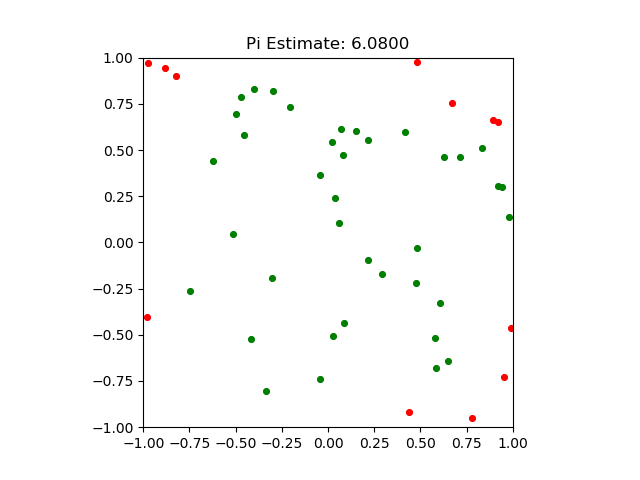

# Monte Carlo Estimation of π (pi) in Python
[Based on the math found here](https://web.archive.org/web/20191123051821/mathfaculty.fullerton.edu/mathews/n2003/montecarlopimod.html), this script estimates pi using a [Monte Carlo simulation](https://en.wikipedia.org/wiki/Monte_Carlo_method).

## Example

